# main-station automation

## Cucumber 是什么
  
Cucumber 是 BDD 模式下实现可执行规范（Executable Specifications）的开源工具，但是它的使命并不局限于做自动化验收测试，更加重要的在于其能够在团队成员之间构建统一的交流基础（feature 文件）、规范交流用语（Domain Specific Language）、提高各个利益相关方（Business Stakeholders）沟通效率和效果，从而达到提升产品质量、做成客户期望得到的产品这一最终目标。

## 如何使用 Cucumber

Cucumber 有很多种语言的实现版本，例如 Java、Ruby、.NET、JavaScript 等等，并且 Cucumber 可以和主流的测试框架很好地集成，常见的 Selenium、SpringFramework、Ruby on Rails 等，能够方便地引入到您的测试工作中去，几乎没有任何门槛。本文以一个 Java 测试项目为例，介绍如何使用 Cucumber 的 Java 语言实现版本：Cucumber-JVM。


## doc

[cucumber-jvm](https://cucumber.io/)

[selenium](http://www.seleniumframework.com/)


## examples

[CucumberJVMExamples](https://github.com/machzqcq/CucumberJVMExamples)

[cucumber-jvm](https://github.com/cucumber/cucumber-jvm/tree/master/examples)


## Quickstart

本项目是用[maven](http://maven.apache.org/)构建的，它是一种项目构建工具，可以管理项目的依赖和插件以及打包方式，还可以根据不同的环境选择不同的配置文件

### 将 Cucumber-JVM 依赖加入到项目中

    <dependencies>
        <dependency>
            <groupId>info.cukes</groupId>
            <artifactId>cucumber-java</artifactId>
            <version>${cucumber.version}</version>
        </dependency>
        <dependency>
            <groupId>info.cukes</groupId>
            <artifactId>cucumber-java8</artifactId>
            <version>${cucumber.version}</version>
        </dependency>
        <dependency>
            <groupId>info.cukes</groupId>
            <artifactId>cucumber-testng</artifactId>
            <version>${cucumber.version}</version>
        </dependency>
        <dependency>
            <groupId>info.cukes</groupId>
            <artifactId>cucumber-junit</artifactId>
            <version>${cucumber.version}</version>
        </dependency>
        <dependency>
            <groupId>info.cukes</groupId>
            <artifactId>cucumber-picocontainer</artifactId>
            <version>${cucumber.picocontainer.version}</version>
            <scope>test</scope>
        </dependency>
    </dependencies>

关于版本，请自己选择自己适合版本。本项目使用的是 ` <cucumber.version>1.2.5</cucumber.version>`

### 编写 Executable Specification

Cucumber 之所以受到如此的推崇，与其 Executable Specification 这个特性不无关系。顾名思义，可执行规范给出了至少两个方面的意义：

*   可执行性（Executable）：您可以像执行代码（Java、Ruby...）一样运行这些规范，来验证、验收目标应用。当然，这一点是从技术人员的视角来看的；

*   规范性（Specification）：从非技术人员的视角触发，相比验证本身，他们更加关心系统功能的清晰描述：系统在什么场景下能够做什么样的事情。

这看似简单的两方面似乎关联并不是很大，但是如何能够在同一个基础（feature files）之上做到两者的融合，却是 Cucumber 最大的妙处。从项目管理人员的角度来看，Cucumber 是技术人员和非技术人员交流的桥梁，从更加深的层面来看，Cucumber 能够增加各个利益相关方的沟通，因为只有深入的沟通，在各方都理解了真正期望的功能这一基础之上，才能产出都认可的 Executable Specification！

Cucumber 是以 feature 文件来组织测试的,所以采用 feature 这个后缀。我们现在以 "打开东方融资网" 测试案例为例子，需要如下的大致步骤：

1.  创建 feature 文件；

    [RongziAddress.feature](src/test/resources/features/RongziAddress.feature)

        # language: zh-CN
        
        @login
        功能: 登陆东方融资网
        
          @index
          场景: 打开首页
            假如 我在主站首页
            那么 主站首页的主题是"上海贷款，上海贷款公司，上海抵押贷款，上海小额贷款-东方融资网"
            
    `@login`，是tags，就是给场景定义一个标签，到时候可以根据标签来运行测试场景
       
    `# language: zh-CN` 代表 feature 文件中所使用的描述语言是中文简体，，Cucumber 本身支持超过 30 种语言（此处语言是 Spoken Language 而非 Programming Language）
                                                    
    通过`java cucumber.api.cli.Main --i18n help` 查看所支持的所有 Spoken Language；
         
         
          | feature | "功能" |
          | background | "背景" |
          | scenario | "场景", "剧本" |
          | scenario outline | "场景大纲", "剧本大纲" |
          | examples | "例子" |
          | given | "* ", "假如", "假设", "假定" |
          | when | "* ", "当" |
          | then | "* ", "那么" |
          | and | "* ", "而且", "并且", "同时" |
          | but | "* ", "但是" |
          | given (code) | "假如", "假设", "假定" |
          | when (code) | "当" |
          | then (code) | "那么" |
          | and (code) | "而且", "并且", "同时" |
          | but (code) | "但是" |
       
      
2.  生成测试 Step Definitions；

    *   在 Intellij IDEA 下生成 Steps definitions
        
        在编写 feature 文件的过程中，IDEA 会提示目前文件中哪些步骤（steps）是没有对应的 Java step definitions，如下图所示，Intellij IDEA 会以黄色的小灯泡这个提示标志来提醒作者：
        
        (1)  点击该提示图标，并从弹出的菜单项中选择“Create Step Definition”或者“Create All Steps Definition”；
   
        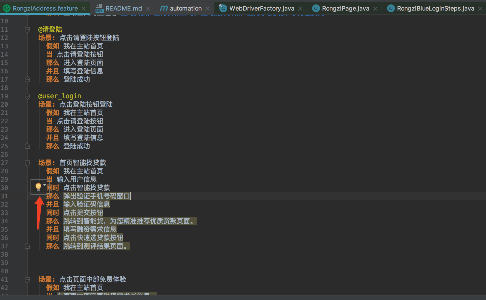 
        
        (2)  在弹出的“Create New Step Definition File”模式窗口中填写文件名称、实现语言以及文件位置等信息即可；
           
        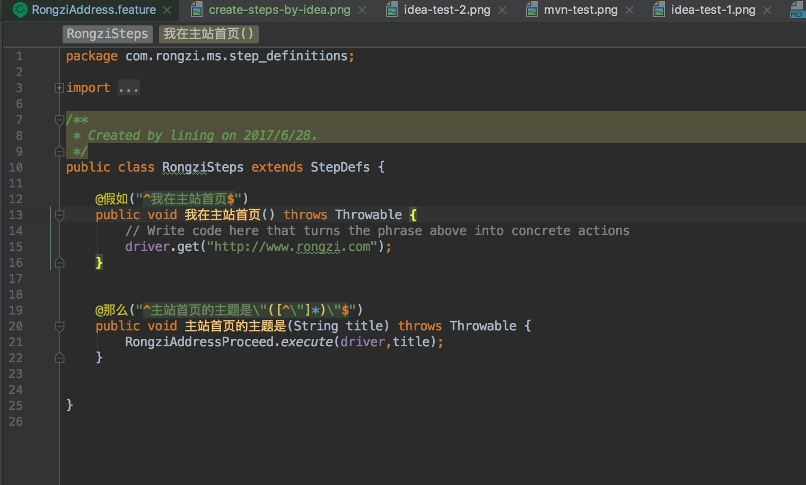   

3.  运行测试用例。

    *   Run with JUnit 方式；
    
        这种方式要求必须有 JUnit Test 来触发，常规的做法是：创建一个空白的 JUnit Test，[RunCukesTest](src/test/java/com/rongzi/ms/step_definitions/RunCukesTest.java)
        
        
            package com.rongzi.ms.step_definitions;
            
            import org.junit.runner.RunWith;
            
            import cucumber.api.CucumberOptions;
            import cucumber.api.junit.Cucumber;
            
            @RunWith(Cucumber.class)
            @CucumberOptions(   
                    features = "classpath:features",
                    plugin = {
                            "pretty",
                            "html:target/pretty",
                            "json:target/cucumber.json"
                    },
                    tags = {}
            )
            public class RunCukesTest {
            
            }
        

### 运行

运行 `mvn test` 

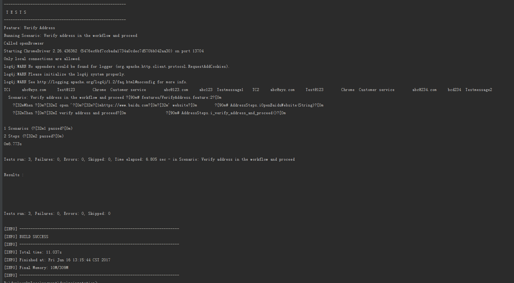 

生成报告 `mvn verify`, 在 *target/reports* 目录下就可以浏览生成的报告.

 

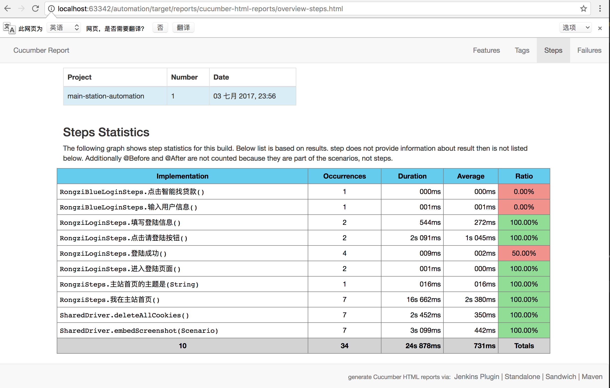 

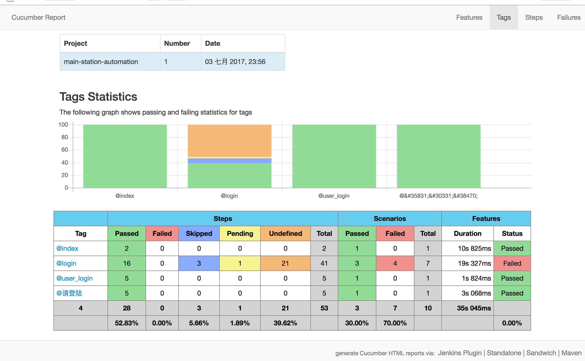 

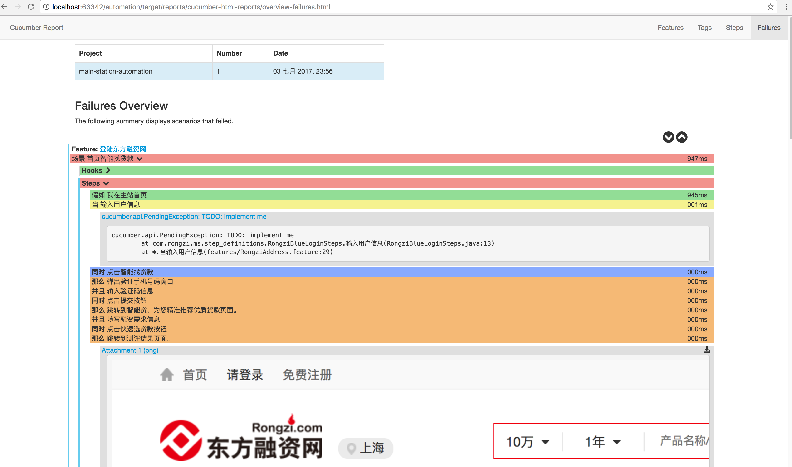


下载driver ` mvn com.lazerycode.selenium:driver-binary-downloader-maven-plugin:selenium`

设置测试的浏览器 `mvn clean verify -Dwebdriver=chrome`

设置测试环境 `mvn clean verify -Dwebdriver=chrome -Pprod`

设置测试的城市 `mvn clean verify -Dwebdriver=chrome -Pprod -Drongzi.city=上海市`

设置测试Selenium Grid的地址 `mvn clean verify -Dwebdriver=chrome -Pprod -Drongzi.city=上海 -Dremote.hub=http://192.168.199.106:4444/wd/hub`

根据tags来过滤场景

*   测试PC登录页
    
```
    mvn clean verify -Dwebdriver=chrome -Dcucumber.options="--tags @web_login"
```

*   测试PC着陆页
    
```
    mvn clean verify -Dwebdriver=chrome -Dcucumber.options="--tags @web_lp"
```

*   测试M站着陆页
    
```
    mvn clean verify -Dwebdriver=android -Drongzi.city=上海 -Dcucumber.options="--tags @mobile"
    
```

*   测试PC登录页和着陆页
    
```
    mvn clean verify -Dwebdriver=chrome -Dcucumber.options="--tags @web_login,@web_lp"
```

*   测试admin后台
    
```
    mvn clean verify -Dwebdriver=chrome -Dcucumber.options="--tags @admin"
```

## [Appium](http://appium.io/) 

### Appium 是什么？

Appium是一个移动端的自动化框架，可用于测试原生应用，移动网页应用和混合型应用，且是跨平台的。可用于IOS和Android以及firefox的操作系统。原生的应用是指用android或ios的sdk编写的应用，移动网页应用是指网页应用，类似于ios中safari应用或者Chrome应用或者类浏览器的应用。混合应用是指一种包裹webview的应用,原生应用于网页内容交互性的应用。
重要的是Appium是跨平台的，何为跨平台，意思就是可以针对不同的平台用一套api来编写测试用例

### Appium环境搭建

* 安装Appium
    
    有两种方式安装，[NPM](https://npmjs.com/)安装或者下载[桌面版](https://github.com/appium/appium-desktop)

    通过NPM安装的话只需要西面几个步骤
    
    1.安装[node.js](http://nodejs.cn/) `brew install node`
    
    2.安装appium `npm install -g appium`
    
    3.安装appium doctor `npm install -g appium-doctor`
    
    4.检查环境 `appium-doctor`
    
    ```
    ➜  ~ appium-doctor
    info AppiumDoctor Appium Doctor v.1.4.3
    info AppiumDoctor ### Diagnostic starting ###
    info AppiumDoctor  ✔ The Node.js binary was found at: /usr/local/bin/node
    info AppiumDoctor  ✔ Node version is 8.7.0
    info AppiumDoctor  ✔ Xcode is installed at: /Applications/Xcode.app/Contents/Developer
    info AppiumDoctor  ✔ Xcode Command Line Tools are installed.
    info AppiumDoctor  ✔ DevToolsSecurity is enabled.
    info AppiumDoctor  ✔ The Authorization DB is set up properly.
    info AppiumDoctor  ✔ Carthage was found at: /usr/local/bin/carthage
    info AppiumDoctor  ✔ HOME is set to: /Users/lining
    info AppiumDoctor  ✔ ANDROID_HOME is set to: /Users/lining/Library/Android/sdk
    info AppiumDoctor  ✔ JAVA_HOME is set to: /Library/Java/JavaVirtualMachines/jdk1.8.0_131.jdk/Contents/Home
    info AppiumDoctor  ✔ adb exists at: /Users/lining/Library/Android/sdk/platform-tools/adb
    info AppiumDoctor  ✔ android exists at: /Users/lining/Library/Android/sdk/tools/android
    info AppiumDoctor  ✔ emulator exists at: /Users/lining/Library/Android/sdk/tools/emulator
    info AppiumDoctor  ✔ Bin directory of $JAVA_HOME is set
    info AppiumDoctor ### Diagnostic completed, no fix needed. ###
    info AppiumDoctor
    info AppiumDoctor Everything looks good, bye!
    info AppiumDoctor
    ```
    
* 运行
  
  1.本地运行 `appium`
  
  ```
  ➜  ~ appium
  [Appium] Welcome to Appium v1.6.5
  [Appium] Appium REST http interface listener started on 0.0.0.0:4723
  ```
  
  2.[代码方式启动](https://github.com/appium/java-client/blob/master/docs/The-starting-of-an-app-using-Appium-node-server-started-programmatically.md)
  
  ```
  DesiredCapabilities capabilities = new DesiredCapabilities();
  capabilities.setCapability(MobileCapabilityType.PLATFORM_VERSION, "10.3");
  capabilities.setCapability(MobileCapabilityType.BROWSER_NAME, "Safari");
  capabilities.setCapability(MobileCapabilityType.DEVICE_NAME, "iPhone Simulator");
  capabilities.setCapability(MobileCapabilityType.AUTOMATION_NAME, "XCUITest");
  AppiumServiceBuilder builder = new AppiumServiceBuilder().
                                         withArgument(GeneralServerFlag.LOG_LEVEL, Env.getProperty("appium.log.level", "info")).
                                         usingAnyFreePort() /*and so on*/;
  IOSDriver<MobileElement> driver = new IOSDriver<>(builder, capabilities);
  ```
  
  3.本地运行并且注册到 Selenium Grid `appium --nodeconfig /path/to/nodeconfig.json`
  
  ```
  ➜  ~ appium --nodeconfig /Users/lining/dev/workspace/main-station/src/test/resources/config/node.json
  [Appium] Welcome to Appium v1.6.5
  [Appium] Non-default server args:
  [Appium]   nodeconfig: /Users/lining/dev/workspace/main-station/src/test/resources/config/node.json
  [debug] [Appium] Starting auto register thread for grid. Will try to register every 5000 ms.
  [Appium] Appium REST http interface listener started on 0.0.0.0:4723
  ```
  
  [node.json](config/node.json)
  
  ```
  {
    "capabilities":
        [
          {
            "browserName": "<e.g._iPhone5_or_iPad4>",
            "version":"<version_of_iOS_e.g._7.1>",
            "maxInstances": 1,
            "platform":"<platform_e.g._MAC_or_ANDROID>"
          }
        ],
    "configuration":
    {
      "cleanUpCycle":2000,
      "timeout":30000,
      "proxy": "org.openqa.grid.selenium.proxy.DefaultRemoteProxy",
      "url":"http://<host_name_appium_server_or_ip-address_appium_server>:<appium_port>/wd/hub",
      "host": <host_name_appium_server_or_ip-address_appium_server>,
      "port": <appium_port>,
      "maxSession": 1,
      "register": true,
      "registerCycle": 5000,
      "hubPort": <grid_port>,
      "hubHost": "<Grid_host_name_or_grid_ip-address>"
    }
  }
  ```
* 停止

有时候我们不是正常退出appium的时候，我们可以通过 `ps -ef | grep appium` 来查找 appium进程号，然后再通过 `kill -9 进程号` 来杀掉进程

```
➜  ~ ps -ef | grep appium
  501 14922  8088   0  7:49AM ttys000    0:00.00 grep appium
  501 14183 10561   0  7:41PM ttys001    0:12.50 node /usr/local/bin/appium --nodeconfig /Users/wangxiaoyu/main-station/src/test/resources/config/node.json

➜  ~ kill -9 14183

```


### [appium client](https://github.com/appium/appium/blob/master/docs/cn/about-appium/appium-clients.md)

* [Java](https://github.com/appium/java-client)

* [sample code](https://github.com/appium/sample-code)

## [Selenium Grid](http://www.seleniumhq.org/projects/grid/)

### Selenium Grid 是什么？

Selenium 是针对Web应用的自动化测试框架和工具集合，支持多种浏览器和编程语言。Selenium的测试用例直接运行在浏览器中，并模拟用户的操作。

Selenium Grid是一个分布式Web测试工具，可以将测试透明地分发到多个主机上，并行地执行。Selenium Grid架构中包含两个主要角色：Hub是中心点控制节点，而Node是Selenium的工作节点，它们注册到Hub上，并会操作浏览器执行由Hub下发的自动测试用例。

### Selenium Grid 基本结构


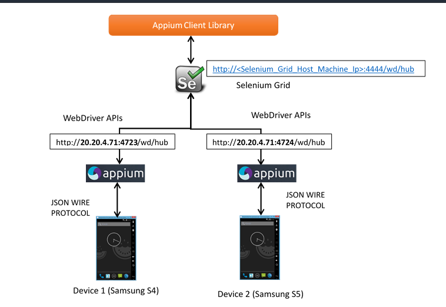


## [zalenium](https://github.com/zalando/zalenium)

### 介绍

zalenium是一种以容器方式来动态创建和管理本地Selenium Grid的扩展。它使用[docker-selenium](https://github.com/elgalu/docker-selenium)在本地运行基于Firefox和Chrome的测试。

### 环境

* 安装[Docker](https://www.docker.com/)版本要大于1.11

    1.安装依赖
    ```
    $ sudo yum install -y yum-utils \
      device-mapper-persistent-data \
      lvm2
    ```
    2.设置 repo 地址
    ```
    $ sudo yum-config-manager \
        --add-repo \
        https://download.docker.com/linux/centos/docker-ce.repo
    ```
    3.安装 docker-ce
    ```
    $ sudo yum install docker-ce
    ```
    4.添加指定用户到docker用户组
    ```
    $ sudo usermod -aG docker your_username
    ```
    5.启动 docker
    ```
    $ sudo systemctl start docker
    ```
    6.停止 docker
    ```
    $ sudo systemctl stop docker
    ```
    7.设置开机启动
    ```
    $ sudo systemctl enable docker
    ```

    检查 `docker -v`

    ```
    ➜  ~ docker -v
    Docker version 17.03.1-ce, build c6d412e
    ```
    常用命令
        
    ```
    # 拉取镜像
    docker pull jenkins
    # 查看本地镜像列表
    docker images
    # 查看容器列表
    docker ps -a
    # 查看容器日志
    docker logs -f jenkins_ms-jenkins_1
    
    ```
* 安装[Docker compose](https://docs.docker.com/compose/)

    1.下载docker-compose
    ```
    sudo curl -L https://github.com/docker/compose/releases/download/1.17.0/docker-compose-`uname -s`-`uname -m` -o /usr/local/bin/docker-compose
    ```
    2.设置权限
    ```
    sudo chmod +x /usr/local/bin/docker-compose
    ```

    检查 `docker-compose -v`

    ```
    ➜  ~ docker-compose -v
    docker-compose version 1.11.2, build dfed245
    ```
    
    常用命令
    
    ```
    # 创建容器
    docker-compose up -d
    # 停止容器
    docker-compose stop
    # 启动容器
    docker-compose start
    # 删除容器
    docker-compose down
    # 查看容器日志
    docker-compose logs -f
    
    ```

### 运行

zalenium 用docker来动态按需扩展浏览器容器实例，所以我们需要将主机的docker.sock挂载到zalenium容器中，这就是"Docker alongside Docker"。

* `docker pull dosel/zalenium`
* `docker pull elgalu/selenium`
* `docker-compose -f src/docker/grid/zalenium.yml up -d`

[zalenium.yml](src/docker/grid/zalenium.yml)

```
# Usage:
#   docker-compose up --force-recreate
version: '2.1'

services:
  #--------------#
  zalenium:
    image: dosel/zalenium
    container_name: zalenium
    hostname: zalenium
    tty: true
    volumes:
      - /tmp/videos:/home/seluser/videos
      - /var/run/docker.sock:/var/run/docker.sock
      - /usr/bin/docker:/usr/bin/docker
    ports:
      - 4444:4444
      - 5555:5555
    command: >
      start --chromeContainers 1
            --firefoxContainers 1
            --maxDockerSeleniumContainers 8
            --screenWidth 1024 --screenHeight 768
            --timeZone "Europe/Berlin"
            --videoRecordingEnabled true
            --sauceLabsEnabled false
            --browserStackEnabled false
            --testingBotEnabled false
            --startTunnel false
    environment:
      - HOST_UID
      - HOST_GID
      - SAUCE_USERNAME
      - SAUCE_ACCESS_KEY
      - BROWSER_STACK_USER
      - BROWSER_STACK_KEY
      - TESTINGBOT_KEY
      - TESTINGBOT_SECRET

```

### 额外的特性

*   [Dashboard](http://localhost:4444/dashboard)控制面板，在测试完成后，可以查看所有的测试录制视频和收集的测试日志。


*   [Live preview](http://localhost:4444/grid/admin/live)实时预览运行的测试


*   支持一些第三方的云测试平台


## [jenkins](https://jenkins.io/)

1.  docker化安装jenkins `docker-compose -f src/docker/jenkins/jenkins.yml up -d`

    [jenkins.yml](src/docker/jenkins/jenkins.yml)
    
    ```
    version: '2.1'
    services:
      ms-jenkins:
        image: jenkins:latest
        extra_hosts:
            - "zalenium:192.168.199.106"
        ports:
          - 38080:8080
          - 30000:50000
        # uncomment for docker in docker
        #privileged: true
        volumes:
            # enable persistent volume (warning: make sure that the local jenkins_home folder is created)
            - ~/volumes/jenkins_home:/var/jenkins_home
            # mount docker sock and binary for docker in docker (only works on linux)
            - /var/run/docker.sock:/var/run/docker.sock
            - /usr/bin/docker:/usr/bin/docker
    ```
    
2.  创建jenkins pipeline 任务，[Pipeline Syntax](https://jenkins.io/doc/book/pipeline/)

    * 安装[Cucumber Reports Plugin](https://wiki.jenkins.io/display/JENKINS/Cucumber+Reports+Plugin)
    
      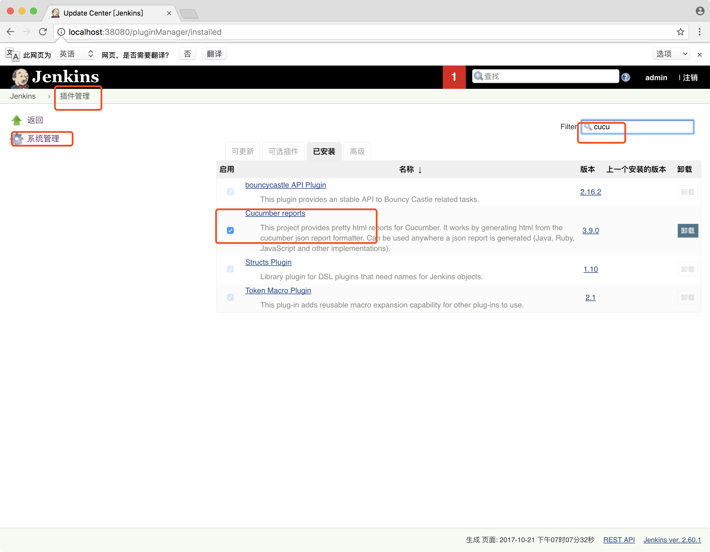 

    * 点击新建，选择 pipeline，填写job名称
    
      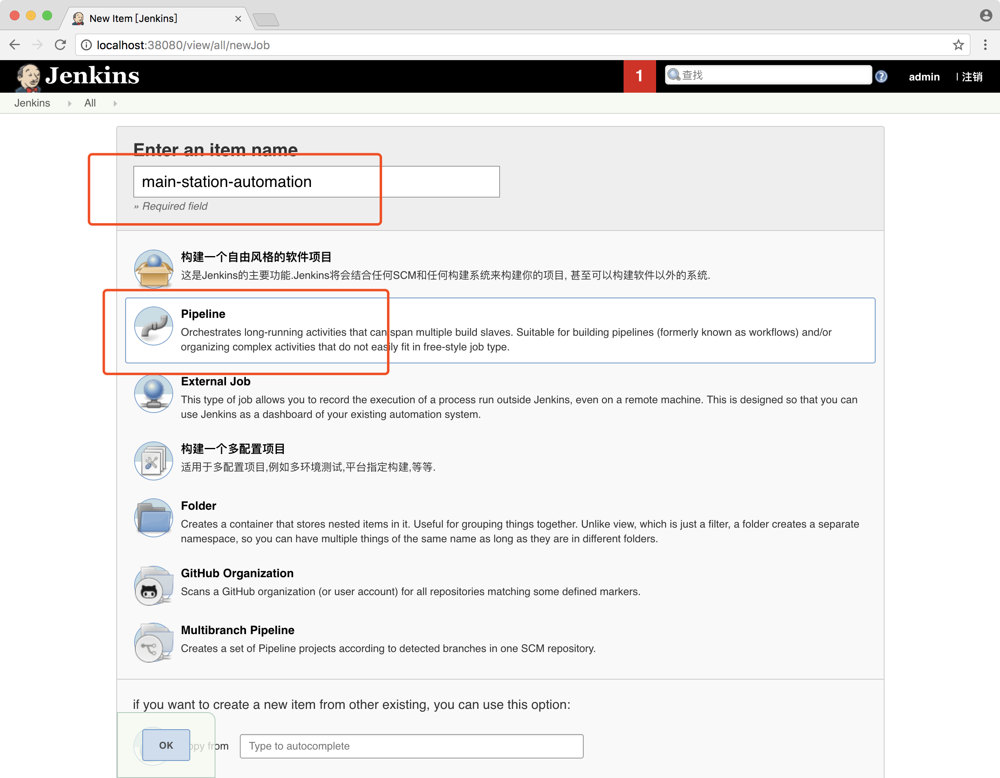 

    * 选择[Jenkinsfile](Jenkinsfile.lp)
    
      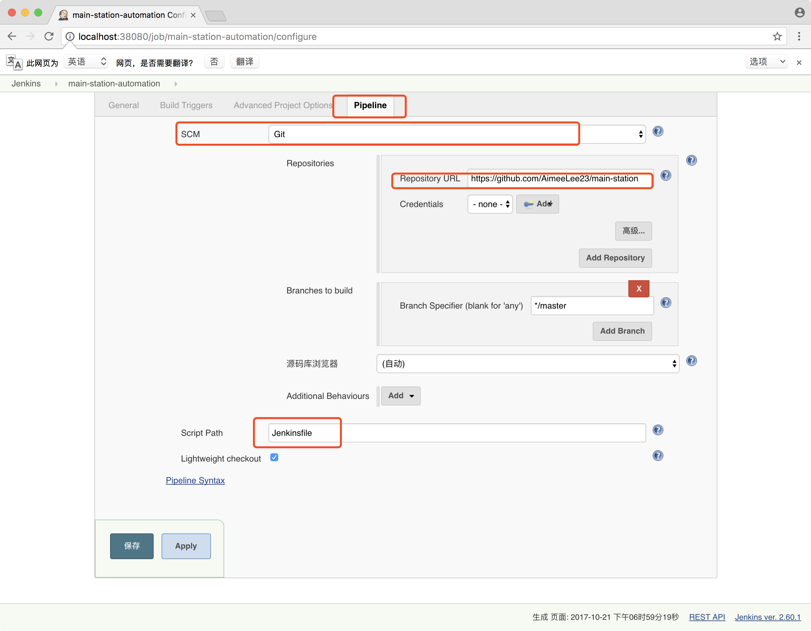 
    
    ```
    #!/usr/bin/env groovy
    
    node {
    
        stage('checkout') {
            checkout scm
        }
    
        stage('check java') {
            sh "java -version"
        }
    
        stage('check maven') {
            sh "./mvnw -v"
        }
    
        stage('automation tests') {
    
            //run your build
            sh './mvnw clean verify -Pprod -Dcucumber.options="--tags @web_login,@web_lp" -Dwebdriver=chrome -Dremote.hub=http://zalenium:4444/wd/hub'
            //generate cucumber reports
            cucumber '**/*.json'
    
        }
    
    
    
    
    }
    ```
    * 构建任务
    
      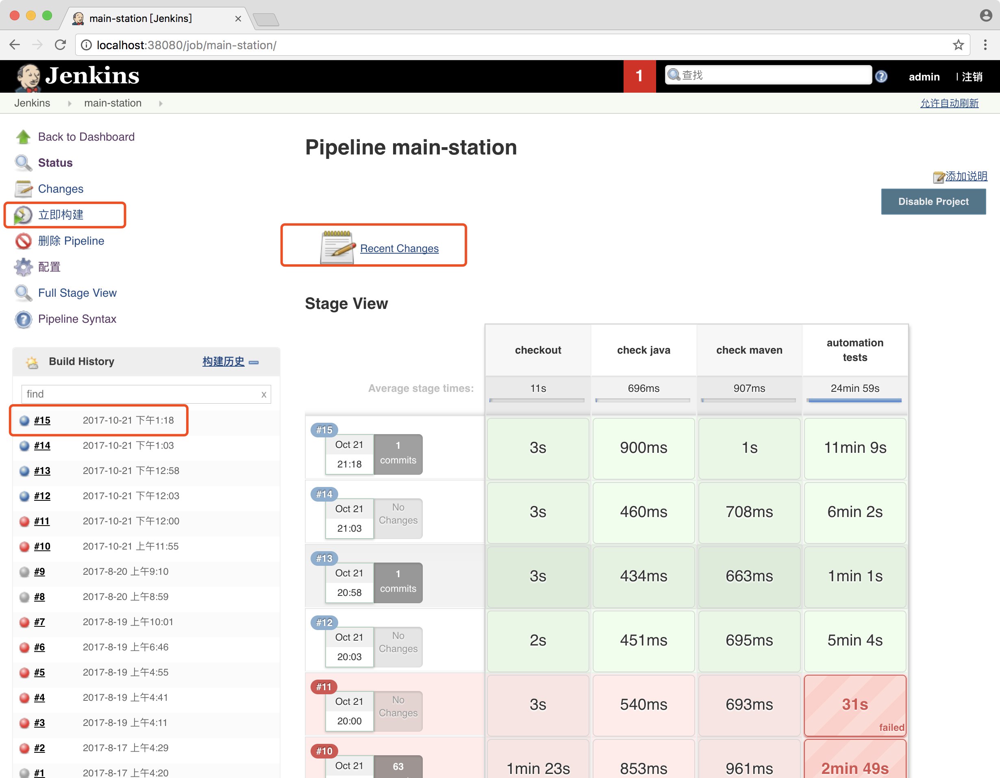 
    
    * 日志
    
      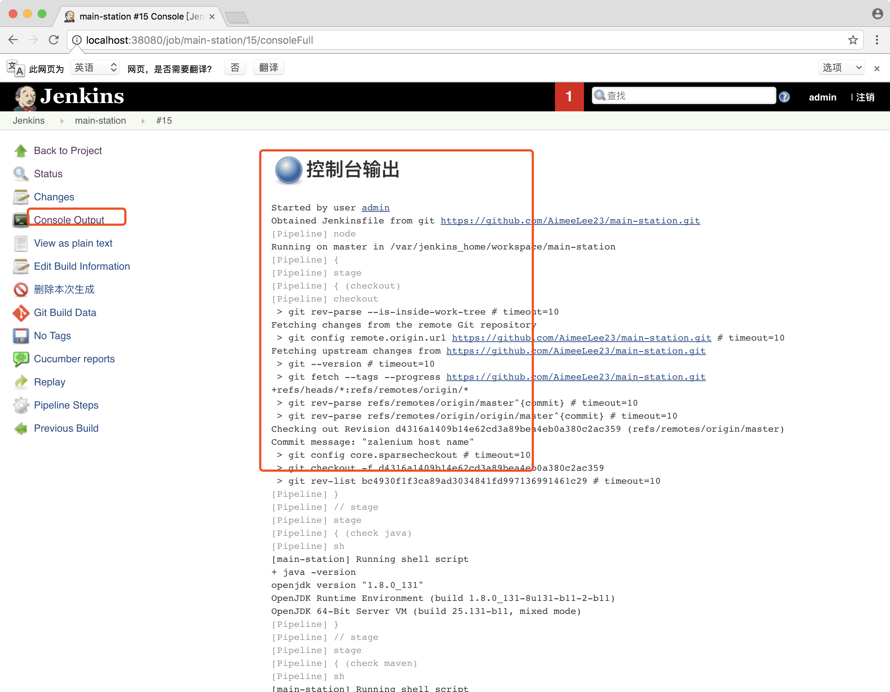 
      
    * 查看 cucumber report
    
      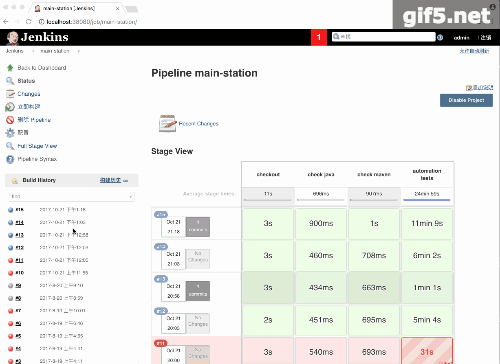 


3.  设置启动测试脚本的条件，比如开发部署完新版本的应用后开始启动自动化测试的jenkins任务

    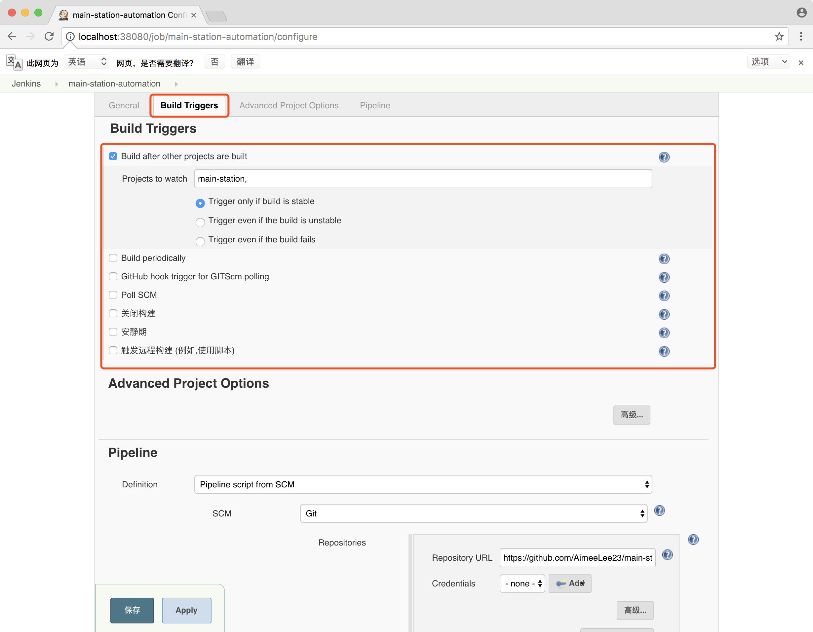 

4.  [Selenium Plugin](https://wiki.jenkins.io/display/JENKINS/Selenium+Plugin)

## 项目部署

1.  进入[docker](src/docker) 目录, `cd src/docker`

2.  部署测试环境, `make up`

```
➜ make up
docker-compose up -d
Creating network "docker_default" with the default driver
Creating zalenium ... 
Creating docker_ms-jenkins_1 ... 
Creating docker_ms-jenkins_1
Creating docker_ms-jenkins_1 ... done
docker-compose ps
       Name                      Command               State                         Ports                      
----------------------------------------------------------------------------------------------------------------
docker_ms-jenkins_1   /bin/tini -- /usr/local/bi ...   Up      0.0.0.0:30000->50000/tcp, 0.0.0.0:38080->8080/tcp
zalenium              entry.sh start --chromeCon ...   Up      0.0.0.0:4444->4444/tcp, 4445/tcp        

```