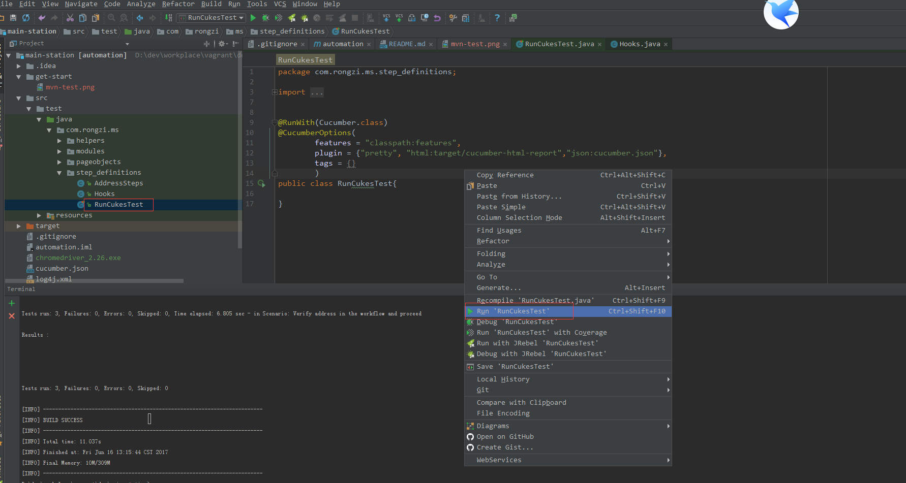
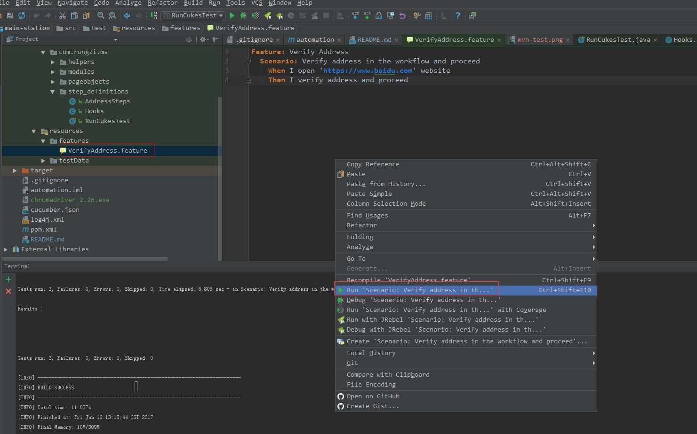

# main-station automation

* [cucumber-jvm](https://cucumber.io/)

* [selenium](http://www.seleniumframework.com/)

## Quickstart

### maven

设置 chrome web driver, `-Dwebdriver.chrome.driver=chromedriver_2.26.exe`

运行 `mvn test -Dwebdriver.chrome.driver=chromedriver_2.26.exe` 

 

### IntelliJ IDEA 

1.  右击 *RunCukesTest* 直接运行

     

2.  右击 *feature* 文件直接运行

    

